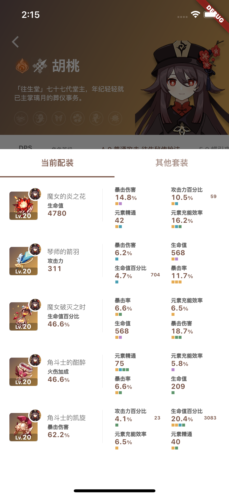
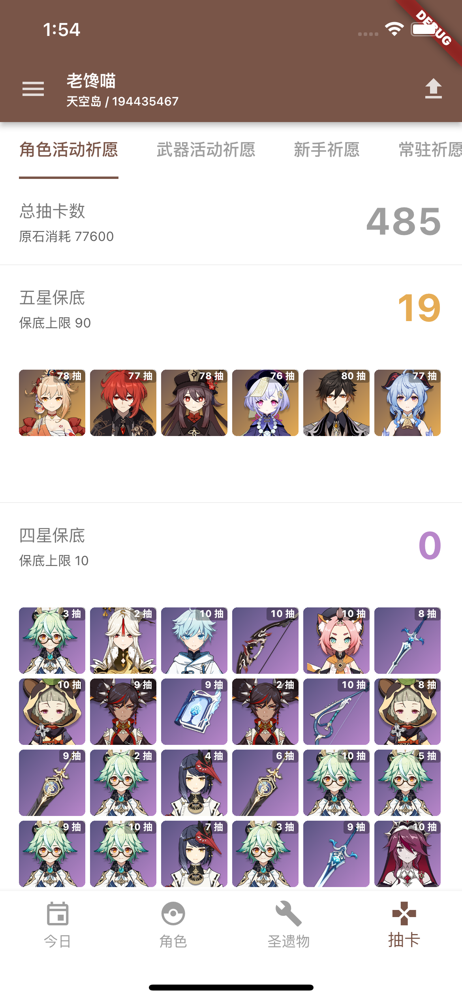

# 原神工具箱

**仅限国服**

* 原神角色/武器培养一览
* 角色伤害计算器
* 圣遗物录入/管理/评分
* 抽卡记录统计

## 安装

code 中 `genshintools-release-*.apk` 文件，下载安装即可

## Q & A

### 如何获取 cookie

先访问 https://bbs.mihoyo.com/ys/ 并登录，
在控制台输入 `btoa(document.cookie)` 获得
或者在地址栏手动输入 `javascript:document.write(btoa(document.cookie))` 获取

### 如何获取 抽卡地址

参考 https://feixiaoqiu.com/rank_url_upload_init/

### 如何设置同步 

例如坚果云 https://help.jianguoyun.com/?p=2064
创建好 WebDAV 账号后，
务必手动创建 `/genshintools` 的 根目录

## 应用截图

|                |                  |                  |     
|----------------|------------------|------------------|
|  |                  |                  |
|  |  |  |
|  |                  |                  |
|  |                  |                  |
